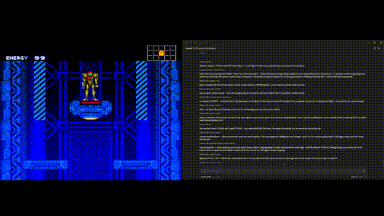

# mcp-bizhawk

[](https://www.npmjs.com/package/mcp-bizhawk)
[](https://www.npmjs.com/package/mcp-bizhawk)
[](https://github.com/dmang-dev/mcp-bizhawk/actions/workflows/ci.yml)
[](LICENSE)

An [MCP](https://modelcontextprotocol.io) server that exposes [BizHawk](https://github.com/TASEmulators/BizHawk) — the multi-system emulator the TAS community lives in — to any MCP-compatible client (Claude Desktop, Claude Code, etc.).

One bridge, **many systems**: NES, SNES, Game Boy / GBC / GBA, Sega Master System / Genesis / 32X / Saturn, N64, PlayStation 1, Atari 2600/5200/7800, Lynx, ColecoVision, Intellivision, and more — all through the same MCP tools, with per-system memory domains exposed cleanly.



*Claude (the agent) drives Samus through the opening of Ceres Station — all input batched through `bizhawk_play_input_sequence`, all motion verified by reading WRAM addresses found via live RAM-hunt. Recording is 2× speed; the actual playback runs at native 60fps emulation. See [`docs/RECIPES.md`](docs/RECIPES.md) and [`docs/SUPER-METROID-ADDRESSES.md`](docs/SUPER-METROID-ADDRESSES.md) for the workflow.*

## How it works

```
+------------------+    stdio     +------------------+   TCP :8766   +------------------+
|   MCP client     |   JSON-RPC   |    mcp-bizhawk   |  newline JSON |     BizHawk      |
| (Claude / etc.)  | ===========> |     (Node.js)    | <============ |    bridge.lua    |
+------------------+              +------------------+               +------------------+
```

The transport is **inverted** compared to most other emulator-MCP bridges: BizHawk's Lua doesn't have native server sockets, only an outbound `comm.socketServer*` client. So `mcp-bizhawk` runs the TCP **listener**, and BizHawk's Lua bridge dials in once per frame to ferry commands and replies.

Two pieces:
- **`lua/bridge.lua`** — runs *inside* BizHawk's Lua Console, polls our TCP server once per frame
- **`dist/index.js`** — the Node.js MCP server, listens on `127.0.0.1:8766` by default, exposes tools over stdio

Trade-off: this design adds **~one frame of latency** per call (≈16ms at 60Hz). Fine for interactive memory hunting, save-state experimentation, and frame-by-frame inspection. Less ideal for high-rate-of-fire scripting.

## Requirements

- [BizHawk](https://github.com/TASEmulators/BizHawk/releases) **2.6.2 or newer** (earlier builds use an older socket-server wire format)
- **Node.js 18+** (for the MCP server)

Tested on BizHawk 2.11.1 across SNES (Super Metroid). Should work on any system BizHawk supports.

## Install

### Option A — install from npm (recommended)

```bash
npm install -g mcp-bizhawk
```

### Option B — `npx` (no install)

```bash
npx -y mcp-bizhawk
```

### Option C — clone and develop

```bash
git clone https://github.com/dmang-dev/mcp-bizhawk
cd mcp-bizhawk
npm install        # also runs the build via the `prepare` hook
```

## Set up the BizHawk bridge

There are two pieces to configure: telling BizHawk where to connect, and loading the bridge script.

### 1. Point BizHawk at the MCP server

Easiest: launch BizHawk with the socket flags directly.

```bash
EmuHawk.exe --socket_ip=127.0.0.1 --socket_port=8766 <path/to/rom>
```

(Adjust port if you're overriding `BIZHAWK_PORT`.)

Alternative: configure persistently via **Settings → Customize → External Tools** in BizHawk's UI.

### 2. Load the bridge script

In BizHawk: **Tools → Lua Console → Open Script** → select `lua/bridge.lua` from this repo.

You should see in the Lua Console:
```
[mcp-bizhawk] bridge starting
[mcp-bizhawk] socket server target: 127.0.0.1:8766
[mcp-bizhawk] socket receive timeout set to 50ms
[mcp-bizhawk] frame loop active — bridge is polling once per frame
```

And in the `mcp-bizhawk` process's stderr:
```
[mcp-bizhawk] BizHawk client connected (waiting for bridge.lua to start polling)
[mcp-bizhawk] bridge.lua is polling — bridge ready
```

## Register with your MCP client

### Claude Code (CLI)

```bash
claude mcp add bizhawk --scope user mcp-bizhawk
```

Verify:
```bash
claude mcp list
# bizhawk: mcp-bizhawk - ✓ Connected
```

### Claude Desktop

Edit `claude_desktop_config.json`:

| Platform | Path |
|---|---|
| macOS    | `~/Library/Application Support/Claude/claude_desktop_config.json` |
| Windows  | `%APPDATA%\Claude\claude_desktop_config.json` |
| Linux    | `~/.config/Claude/claude_desktop_config.json` |

```json
{
  "mcpServers": {
    "bizhawk": {
      "command": "mcp-bizhawk"
    }
  }
}
```

Restart Claude Desktop after editing.

### Other MCP clients

The server speaks standard MCP over stdio. Run `mcp-bizhawk` and connect any MCP client to its stdio.

## Configuration

| Env var        | Default       | Purpose                              |
|----------------|---------------|--------------------------------------|
| `BIZHAWK_HOST` | `127.0.0.1`   | TCP host to listen on for BizHawk    |
| `BIZHAWK_PORT` | `8766`        | TCP port to listen on for BizHawk    |

## Tools

| Tool | Description |
|------|-------------|
| `bizhawk_ping` | Verify bridge connectivity (returns `pong`) |
| `bizhawk_get_info` | ROM name, ROM hash, framecount, memory domains, capabilities |
| `bizhawk_list_memory_domains` | List available memory domains for the loaded core |
| `bizhawk_read8` / `bizhawk_read16` / `bizhawk_read32` | Read u8 / u16-LE / u32-LE from memory |
| `bizhawk_write8` / `bizhawk_write16` / `bizhawk_write32` | Write to memory |
| `bizhawk_read_range` | Read up to 4096 bytes as a byte array |
| `bizhawk_write_range` | Write up to 4096 bytes from a byte array |
| `bizhawk_press_buttons` | Set joypad state for one player; keys are button names, values booleans |
| `bizhawk_frame_advance` | Step the emulator by N frames |
| `bizhawk_pause` / `bizhawk_unpause` | Pause / resume emulation |
| `bizhawk_reset` | Reset the loaded core |
| `bizhawk_screenshot` | Save a PNG of the current display to a path |
| `bizhawk_save_state` / `bizhawk_load_state` | Save / load emulator state to a file path |

All memory r/w tools take an optional `domain` parameter — if omitted, the active "current" memory domain is used. Use `bizhawk_list_memory_domains` to discover the names available on the loaded core.

See [`docs/RECIPES.md`](docs/RECIPES.md) for end-to-end examples (RAM hunting on SNES/NES/N64, frame-precise input, snapshot-experiment-restore, cross-system regression testing) and [`CHANGELOG.md`](CHANGELOG.md) for release history.

### Memory domains by system (cheat sheet)

Names come straight from BizHawk's core implementation. Use `bizhawk_list_memory_domains` to see the exact set for the loaded ROM.

| System  | Main RAM domain | Other common domains              |
|---------|-----------------|-----------------------------------|
| NES     | `RAM`           | `PPU`, `OAM`, `PRG ROM`, `CHR`    |
| SNES    | `WRAM`          | `VRAM`, `CARTROM`, `CARTRAM`      |
| GB/GBC  | `WRAM`          | `VRAM`, `HRAM`, `OAM`, `ROM`      |
| GBA     | `EWRAM`, `IWRAM`| `VRAM`, `PALRAM`, `OAM`, `ROM`    |
| Genesis | `68K RAM`       | `VRAM`, `Z80 RAM`, `CARTRAM`      |
| N64     | `RDRAM`         | `SP DMEM`, `SP IMEM`, `PI Reg`    |
| PSX     | `MainRAM`       | `VRAM`, `Scratchpad`, `BIOS`      |

### Buttons by system

BizHawk's `joypad.set` takes a `{ButtonName=true, ...}` table where button names depend on the core. Common ones:

| System  | Names                                                              |
|---------|---------------------------------------------------------------------|
| NES     | `A`, `B`, `Up`, `Down`, `Left`, `Right`, `Start`, `Select`         |
| SNES    | `A`, `B`, `X`, `Y`, `L`, `R`, `Up`, `Down`, `Left`, `Right`, `Start`, `Select` |
| GB/GBC  | `A`, `B`, `Up`, `Down`, `Left`, `Right`, `Start`, `Select`         |
| GBA     | `A`, `B`, `L`, `R`, `Up`, `Down`, `Left`, `Right`, `Start`, `Select` |
| N64     | `A`, `B`, `Z`, `L`, `R`, `Start`, `Up`, `Down`, `Left`, `Right`, `C-Up`, `C-Down`, `C-Left`, `C-Right` |
| Genesis | `A`, `B`, `C`, `X`, `Y`, `Z`, `Up`, `Down`, `Left`, `Right`, `Start`, `Mode` |

If you're unsure, run a probe: `bizhawk_press_buttons {"A": true}` and watch the active core's input display in BizHawk.

## Troubleshooting

| Symptom | Cause / Fix |
|---|---|
| MCP tool calls hang for 10 seconds, then time out with "is the bridge.lua script still polling?" | bridge.lua isn't loaded. In BizHawk: **Tools → Lua Console → Open Script → bridge.lua**. Check the console for `frame loop active`. |
| BizHawk connects to the server but tool calls still time out | You're on BizHawk older than 2.6.2 — the socket wire format changed then. Upgrade BizHawk. |
| `[mcp-bizhawk] FATAL: comm.socketServer* not available` in the Lua Console | BizHawk wasn't launched with `--socket_ip` / `--socket_port` flags, and no socket server is configured in **Settings → Customize → External Tools**. |
| Tools missing in Claude after install | Restart your MCP client; Claude only enumerates servers on startup. |
| Memory reads return zeros for the first few seconds after boot | The emulator hasn't initialized RAM yet. Either advance some frames (`bizhawk_frame_advance`) or check `bizhawk_get_info` to confirm framecount > 0 before relying on game state. |
| `unknown memory domain: <name>` | The domain name didn't match anything for the loaded core. Call `bizhawk_list_memory_domains` to see the actual list — names are case-sensitive. |
| `client.screenshot not available` or `savestate.* not available` | Some BizHawk cores expose a slightly different surface. Check `bizhawk_get_info` — the `capabilities` map shows which optional functions are present on your current build/core combo. |

## Development

```bash
npm install
npm run dev      # tsc --watch — autobuilds on src/ changes
```

End-to-end smoke test (launches BizHawk, loads ROM + bridge, runs ping/get_info/list_memory_domains/read_range):

```bash
node .scratch/test-all.cjs "I:\path\to\your\rom.smc"
```

Set `DEBUG=1` to dump every RX/TX line.

## License

[MIT](LICENSE)
